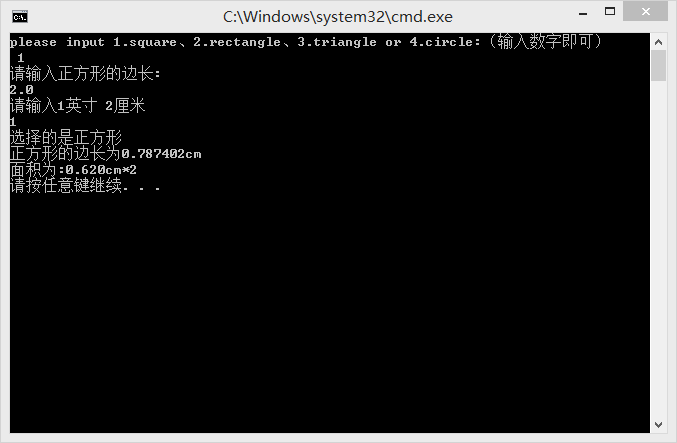
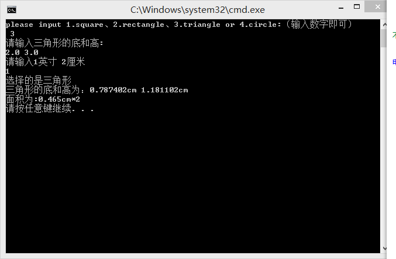
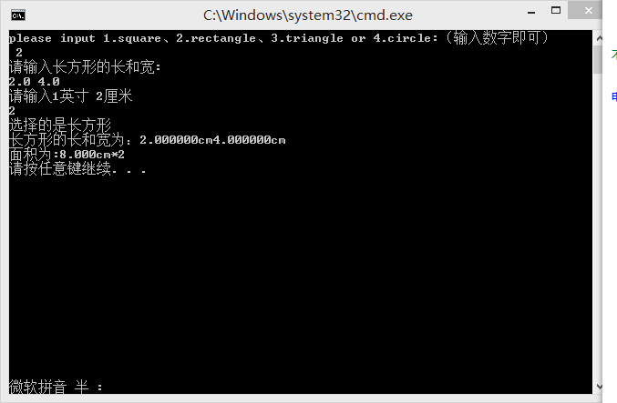
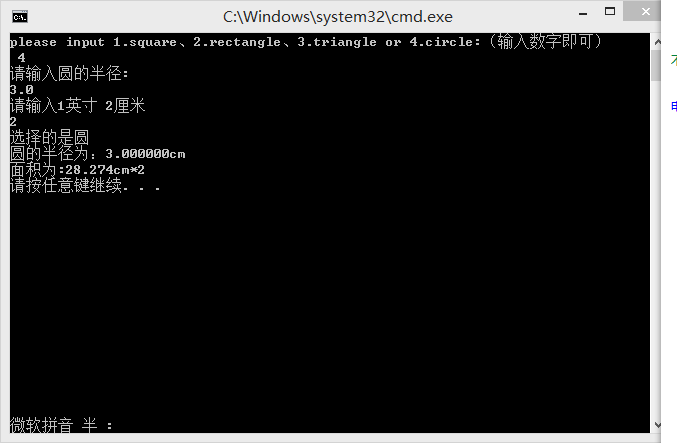

# 简易计算器
   
 ```c
 #include "stdafx.h"

void square()//计算正方形面积
{
            float w, e;
			printf("请输入正方形的边长: \n");
			scanf_s("%f", &w);
			printf("请输入1英寸 2厘米\n");
			int m;
			scanf_s("%d", &m);
			if (m == 1)
			{
				w = w / 2.54;
			}
			e = w * w;
			printf("选择的是正方形\n");
			printf("正方形的边长为%fcm\n", w);
			printf("面积为:%0.3fcm*2\n",e);
}
void rectangle()//计算长方形面积
{
           float r, t, y;
			printf("请输入长方形的长和宽: \n");
			scanf_s("%f %f", &r, &t);
			printf("请输入1英寸 2厘米\n");
			int m;
			scanf_s("%d", &m);
			if (m == 1)
			{
				r= r/2.54;
				t= t/2.54;
			}
			
			y = r * t;
			printf("选择的是长方形\n");
			printf("长方形的长和宽为：%fcm%fcm\n",r,t);
			printf("面积为:%0.3fcm*2\n",y);

}
void triangle()//计算三角形面积
{
float u, i, o;
			printf("请输入三角形的底和高: \n");
			scanf_s("%f %f", &u, &i);
			printf("请输入1英寸 2厘米\n");
			int m;
			scanf_s("%d", &m);
			if (m == 1)
			{
				u=u / 2.54;
				i = i / 2.54;
			}
			
			o = (u*i) / 2;
			printf("选择的是三角形\n");
			printf("三角形的底和高为：%fcm %fcm\n", u,i);
			printf("面积为:%0.3fcm*2\n", o);
}
			
void circle()//计算圆面积
{
float a, d;
			printf("请输入圆的半径: \n");
			scanf_s("%f", &a);
			printf("请输入1英寸 2厘米\n");
			int m;
			scanf_s("%d", &m);
			if (m == 1)
			{
				a=a / 2.54;
			}
			d = 3.14159*a*a;
			printf("选择的是圆\n");
			printf("圆的半径为：%fcm\n", a);
			printf("面积为:%0.3fcm*2\n", d);
}
void main()
{
	printf("please input 1.square、2.rectangle、3.triangle or 4.circle:（输入数字即可）\n ");
	
	int n;
	scanf_s("%d", &n);
		if (n==1)
		{
			square();
		}
		else if (n==2) 
		{	
			rectangle();
		}
		else if (n==3)
		{
			triangle();

		}
		else if (n==4)
		{
			circle();
		}
		else
		{
			printf("error");
		}
	
}
``` 



